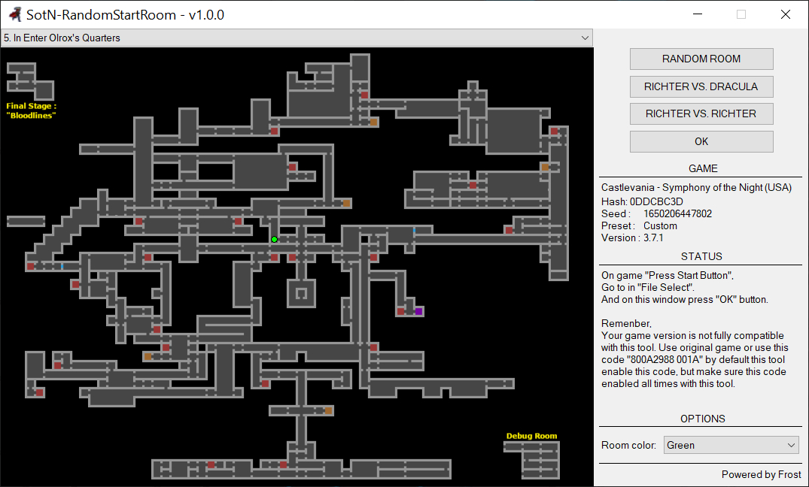
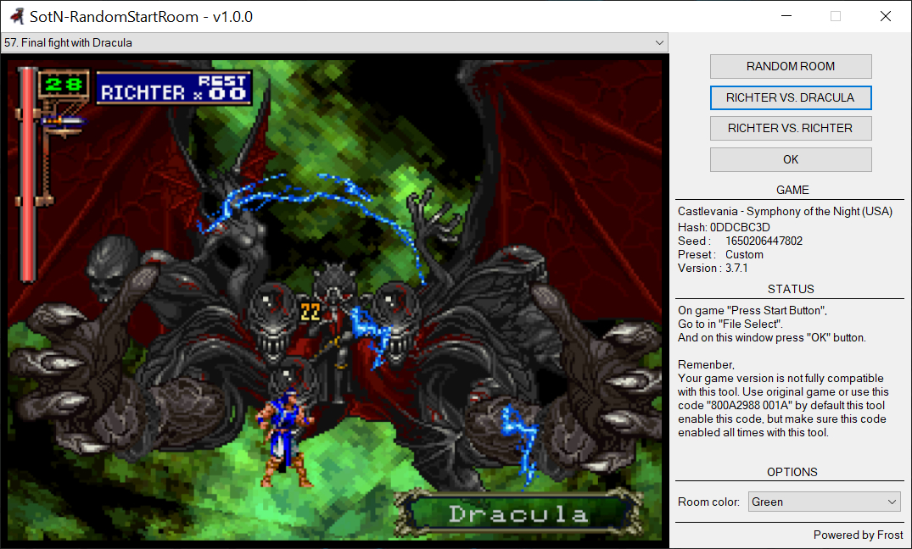

# SotN-RandomStartRoom
<p align="center">
  <a href="LICENSE"></a>
  <a href="https://github.com/PatFrost/SotN-RandomStartRoom/pulls"></a>
  <a href="https://github.com/PatFrost/SotN-RandomStartRoom/issues"></a>
  <a href="https://github.com/PatFrost/SotN-RandomStartRoom/issues"></a>
</p>

SotN-RandomStartRoom is tool for Castlevania: Symphony of the Night
running under [BizHawk](https://tasvideos.org/BizHawk)

## Features!
 - Random start room.
 - Experimental: Randomize start equipements.
 - Richter Vs. Dracula (Final Boss)
 - Richter Vs. Richter

## Requirements
 - [Castlevania: Symphony of the Night (SLUS-00067) NTSC-U](http://redump.org/disc/3379/)
 - [BizHawk 2.7 or higher](https://github.com/TASEmulators/BizHawk/releases).
   - Windows users must download and run the [prereq installer](https://github.com/TASEmulators/BizHawk-Prereqs/releases) first.
 - 
 - **Optional**, but add cool stuff and increase speed to RandomStartRoom
   - [Python 3.10 or higher](https://www.python.org/downloads/) and make sure you select [Add Python to PATH](https://docs.python.org/3/using/windows.html#installation-steps)
   - [psutil 5.9.0 or higher](https://pypi.org/project/psutil/)
   - [pywin32 303 or higher](https://pypi.org/project/pywin32/)

## Installation
Download [SotN-RandomStartRoom-#.zip](https://github.com/PatFrost/SotN-RandomStartRoom/releases/latest) and extract all to your BizHawk folder.
File structure should look like this:
```
BizHawk
└───Lua
│   └───PSX
│   │   └───SotN-RandomStartRoom
│   │   │   - RandomStartRoom.lua <- is main script
│   │   │   - LICENSE
│   │   │   - README.md
│   │   │   - resources
│   │   │     └───...
```

## How to use RandomStartRoom
 1. Start Symphony of the Night under [BizHawk](https://tasvideos.org/BizHawk).
 2. If you used [SotnRandoTools](https://github.com/TalicZealot/SotnRandoTools) start this tool before RandomStartRoom.lua
 3. Open Lua console under BizHawk and open/run RandomStartRoom.lua
 4. On game Symphony of the Night go to gamesave.
 5. On dialog window of SotN-RandomStartRoom press "OK" button.
 6. Now start new game.

## Recommended cool tools
 - [SotnRandoTools](https://github.com/TalicZealot/SotnRandoTools) 
 - [SotN Randomizer](https://sotn.io)

**Cheers!!!**


<p align="center">
  
  
</p>
